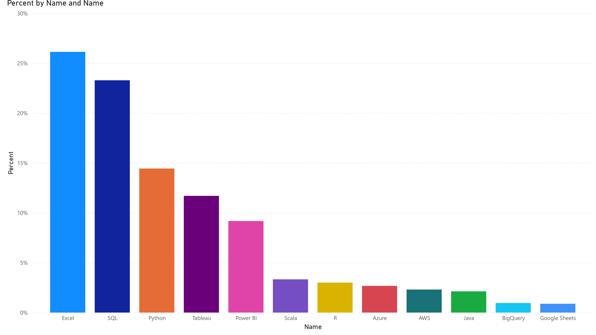
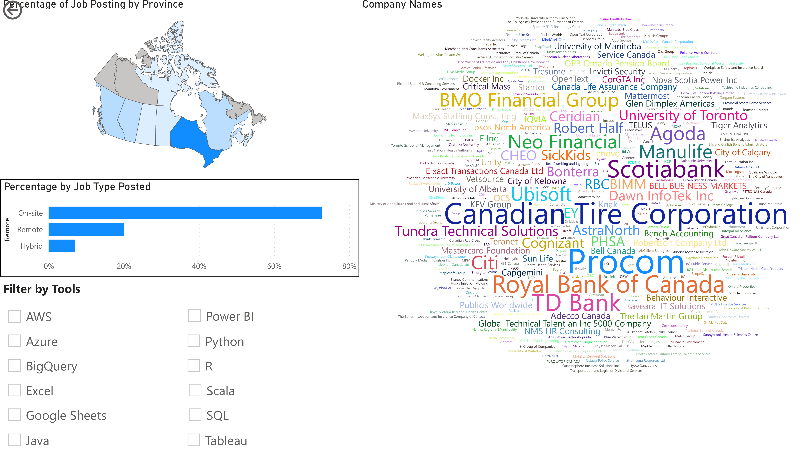

<!-- PROJECT LOGO -->
<br />
<div align="center">
  <a href="https://github.com/github_username/repo_name">
    
  </a>

<h3 align="center">Data Analyst Jobs in Canada</h3>

  <p align="center">
    The objective of this project is to scrape data for jobs site to analyze and rank the top skill employer our seeking to fill Data Analysis job positions in Canada.
    <br />
    <a href="https://github.com/github_username/repo_name"><strong>Explore the docs »</strong></a>
    <br />
    <br />
    <a href="https://github.com/github_username/repo_name">View Demo</a>
    ·
    <a href="https://github.com/github_username/repo_name/issues">Report Bug</a>
    ·
    <a href="https://github.com/github_username/repo_name/issues">Request Feature</a>
  </p>
</div>


<!-- TABLE OF CONTENTS -->
<details>
  <summary>Table of Contents</summary>
  <ol>
    <li>
      <a href="#about-the-project">About The Project</a>
      <ul>
        <li><a href="#built-with">Built With</a></li>
      </ul>
    </li>
    <li>
      <a href="#getting-started">Getting Started</a>
      <ul>
        <li><a href="#prerequisites">Prerequisites</a></li>
        <li><a href="#installation">Installation</a></li>
      </ul>
    </li>
    <li><a href="#usage">Usage</a></li>
    <li><a href="#roadmap">Roadmap</a></li>
    <li><a href="#contributing">Contributing</a></li>
    <li><a href="#license">License</a></li>
    <li><a href="#contact">Contact</a></li>
    <li><a href="#acknowledgments">Acknowledgments</a></li>
  </ol>
</details>


<!-- ABOUT THE PROJECT -->
## About The Project

[![Product Name Screen Shot][product-screenshot]](https://example.com)

Here's a blank template to get started: To avoid retyping too much info. Do a search and replace with your text editor for the following: `github_username`, `repo_name`, `twitter_handle`, `linkedin_username`, `email_client`, `email`, `project_title`, `project_description`


### Built With

* [Python][Python-url]
* [Jupyter][Jupyter-url]
* [Microsoft Power BI][PowerBI-url]
* [PhantomBuster][PhantomBuster-url]
* [Beautiful Soup 4][Beautiful-Soup-4-url]
* [Requests: HTTP for Humans][Requests:-HTTP-for-Humans-url]
* [pandas][pandas-url]
* [NumPy][NumPy-url]


<!-- GETTING STARTED -->
## Getting Started





[View Interactive Report](https://app.powerbi.com/view?r=eyJrIjoiMDk0NjE1NDgtY2IyOC00OTgzLWE0YzktMTJkYTY2ODlhOGMzIiwidCI6Ijg4ZTM4Mzc0LTNjY2MtNDc1Zi1iY2NmLTlkYjg5NGM4MDI4ZiJ9&pageName=ReportSection3965678a7317d91d7e4c)


### Prerequisites

This is an example of how to list things you need to use the software and how to install them.
* npm
  ```sh
  npm install npm@latest -g
  ```

### Installation

1. Get a free API Key at [https://example.com](https://example.com)
2. Clone the repo
   ```sh
   git clone https://github.com/github_username/repo_name.git
   ```
3. Install NPM packages
   ```sh
   npm install
   ```
4. Enter your API in `config.js`
   ```js
   const API_KEY = 'ENTER YOUR API';
   ```


<!-- USAGE EXAMPLES -->
## Usage

Use this space to show useful examples of how a project can be used. Additional screenshots, code examples and demos work well in this space. You may also link to more resources.

_For more examples, please refer to the [Documentation](https://example.com)_


<!-- ROADMAP -->
## Roadmap

- [ ] Feature 1
- [ ] Feature 2
- [ ] Feature 3
    - [ ] Nested Feature

See the [open issues](https://github.com/github_username/repo_name/issues) for a full list of proposed features (and known issues).


<!-- CONTRIBUTING -->
## Contributing

Contributions are what make the open source community such an amazing place to learn, inspire, and create. Any contributions you make are **greatly appreciated**.

If you have a suggestion that would make this better, please fork the repo and create a pull request. You can also simply open an issue with the tag "enhancement".
Don't forget to give the project a star! Thanks again!

1. Fork the Project
2. Create your Feature Branch (`git checkout -b feature/AmazingFeature`)
3. Commit your Changes (`git commit -m 'Add some AmazingFeature'`)
4. Push to the Branch (`git push origin feature/AmazingFeature`)
5. Open a Pull Request


<!-- LICENSE -->
## License

Distributed under the MIT License. See `LICENSE.txt` for more information.


<!-- CONTACT -->
## Contact

Michael Jean -  michaeljean@7101@gmail.com

Project Link: [https://github.com/michael7101/Data-Analyst-Jobs-in-Canada](https://github.com/michael7101/Data-Analyst-Jobs-in-Canada)


<!-- ACKNOWLEDGMENTS -->
## Acknowledgments

* []()
* []()
* []()

<p align="right">(<a href="#readme-top">back to top</a>)</p>


[product-screenshot]: images/screenshot.png
[Python-url]: https://www.python.org/
[Jupyter-url]: https://jupyter.org/
[PowerBI-url]: https://powerbi.microsoft.com/en-gb/
[PhantomBuster-url]: https://phantombuster.com/
[Beautiful-Soup-4-url]: https://beautiful-soup-4.readthedocs.io/en/latest/#
[Requests:-HTTP-for-Humans-url]: https://requests.readthedocs.io/en/latest/
[pandas-url]: https://pandas.pydata.org/
[NumPy-url]: https://numpy.org/ 
